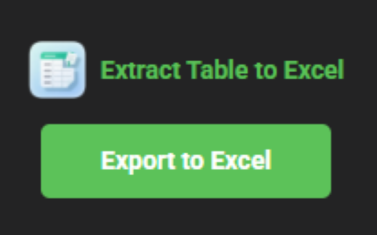

<div align="center">

  

  <h3>나라장터 계약 목록 Table 추출 Chrome Extension</h3>

  <p>
    
    
    
    
  </p>

</div>

---

## Overview

**Table to Excel Exporter**는 나라장터 계약 목록 Page의 Virtual Scroll Table 전체를 자동으로 순회하여 Excel file로 저장하는 Chrome Extension입니다.

나라장터 계약 목록은 Virtual Scroll 방식으로 Rendering 되어 화면에 보이는 Row만 DOM에 존재합니다. 이 Extension은 MutationObserver와 자동 Scroll로 전체 Data를 누락 없이 수집합니다.

---

## Features

| Feature              | Description                             |
| -------------------- | --------------------------------------- |
| Virtual Scroll 자동 순회 | 화면에 보이지 않는 Row까지 자동 Scroll하여 전체 Data 수집 |
| MutationObserver 감지  | DOM 변경을 감지하여 새 Row Rendering 후 즉시 수집    |
| 중복 제거                | Row 번호 기준으로 중복 Data 자동 Filtering        |
| 정렬                   | 수집 완료 후 Row 번호 기준 오름차순 정렬               |
| Excel 저장             | 전체 Table을 `.xlsx` 형식으로 즉시 Download      |

---

## Demo

<div align="center">
  
</div>

---

## Getting Started

### Prerequisites

- Google Chrome Browser

### Installation

**방법 1 — Chrome Web Store (권장)**

[](https://chromewebstore.google.com/detail/table-to-excel-exporter/ccanfgpjjhkjpabmchjclfkhcfnjjdek)

**방법 2 — 수동 설치 (개발자)**

1. 이 Repository Clone 또는 ZIP Download
```bash
git clone https://github.com/Hoporing/G2B_Table_Extractor.git
```

2. Chrome Browser에서 `chrome://extensions` 접속
3. 우측 상단 **개발자 모드** 활성화
4. **압축해제된 확장 프로그램을 로드합니다** → Download Folder 선택

### Usage

1. 나라장터 계약 목록 Page로 이동
2. Click Extension Icon of Chrome
3. Click **Export to Excel** Button
4. 전체 Data 수집 완료 후 `table_data.xlsx` 자동 Download

---

## Output Format

Table Header를 그대로 사용하며 최대 9개 Column을 추출합니다.

| Column  | Description   |
| ------- | ------------- |
| Row No. | 행 번호 (정렬 기준)  |
| 계약번호    | 나라장터 계약 식별 번호 |
| 계약명     | 계약 품목명        |
| 계약업체    | 계약 업체명        |
| 계약일자    | 계약 체결일        |
| 계약금액    | 계약 총액         |
| 납품기한    | 납품 완료 기한      |
| 납품상태    | 현재 납품 진행 상태   |
| 기타      | 추가 정보 (있는 경우) |

---

## Tech Stack

| 항목 | 내용 |
|------|------|
| Platform | Chrome Extension (Manifest V3) |
| Language | JavaScript |
| Excel 생성 | [SheetJS](https://sheetjs.com/) (xlsx.full.min.js) |
| Target Site | 나라장터 (g2b.go.kr) |

---

## License

Apache License 2.0
